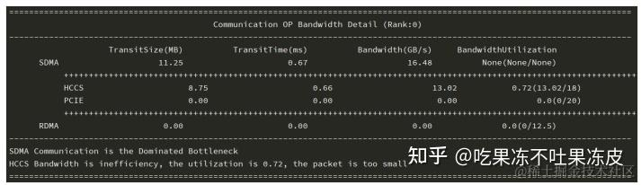
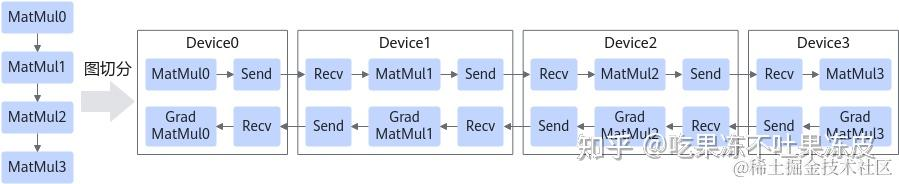
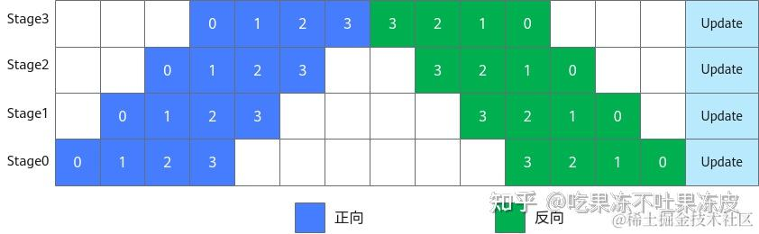
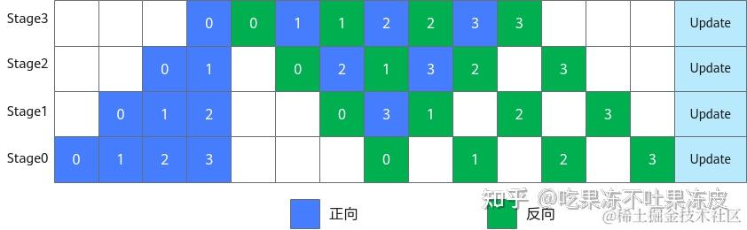
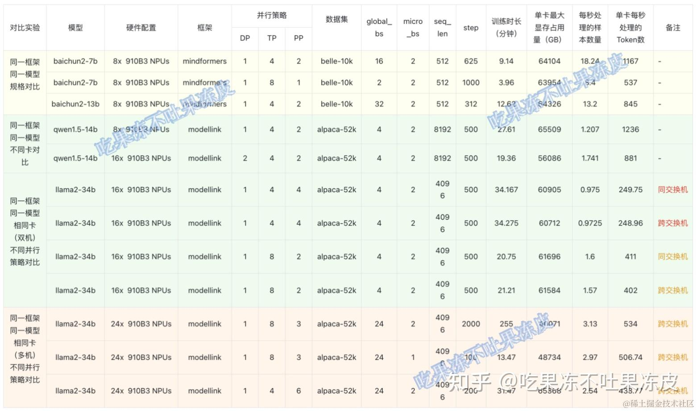

https://zhuanlan.zhihu.com/p/709308176

# 1 训练性能的定义

训练性能在本文指机器（GPU、NPU或其他平台）在指定模型和输入数据的背景下，完成一次端到端训练所需要花费的时间，考虑到不同模型的训练数据量和训练轮次（epoch）差异，此处定义的性能是在完成一个batch训练所需花费的时间。而端到端通常是指完成一个AI模型单步训练的过程。也就是说，本文所讨论的性能的衡量和性能的优化，都是站在模型角度上。

对于一个batch而言，训练所花费的时间主要由以下部分构成：

**单batch总时间 = 数据加载时间 + 模型前反向时间 + 优化器时间 + 模型后处理时间 + 通信时间 + 调度时间**

- **数据加载时间**：指的是模型在加载自身所需要的数据（如图片、视频和文本等）的时间，包括将数据从硬件存储设备读取到CPU（Central Processing Unit）中、CPU中数据的预处理（编解码等操作）、CPU数据放到Device（GPU/NPU...）上的时间。特别地，对于一些需要切分在若干张卡上的模型，数据加载还包括从数据加载卡广播到其他卡上的时间。
- **模型前反向时间**：指深度学习模型的前向过程和反向过程，即Forward和Backward过程，包含前向的数据计算和反向的数据微分求导。
- **优化器时间**：通常指的是模型参数更新时间。
- **模型后处理时间**：一般指的是优化器更新后的时间，包括数据的后处理或者一些必要的同步操作，通常取决于模型特有操作。
- **通信时间**：概念比较宽泛，一般将**单节点内卡与卡**和**多节点间**的通信行为归为通信时间，由于一些AI框架（如：PyTorch）的特殊机制或者优化，通信和计算通常可以并行起来（即通信计算重叠），因此我们一般考虑的是未被计算掩盖的通信时间。
- **调度时间**：指的是模型从CPU的指令到调用NPU侧的核（Kernel）所需要的时间。

# 2 训练性能指标

https://blog.csdn.net/weixin_42605076/article/details/139377171

在模型训练过程中，通常关注的性能指标如下：

|指标名称|单位|指标含义|
|---|---|---|
|吞吐率|samples/s、tokens/s|单位时间（例如1s）内处理的Token数/训练样本数|
|单步时间|s|执行一个step所花费的时间|
|线性度、加速比|values|单卡训练扩展到多卡，单机拓展到集群的效率度量指标|
|内存占用|百分比|-|
|带宽占比|百分比|-|
|训练效率|tokens/day|-|
|浮点运算|TFLOPS|每秒浮点运算次数，是计算设备的计算性能指标|
|模型算力利用率（Model FLOPs Utilization， MFU）|百分比|模型一次前反向计算消耗的矩阵算力与机器算力的比值|
|硬件算力利用率（Hardware FLOPs Utilization， HFU）|百分比|考虑重计算后，模型一次前反向计算消耗的矩阵算力与机器算力的比值|

在计算性能指标时，通常的优先级排序为：**吞吐率 > 单步迭代时间 > 线性度 > 内存占用 > 带宽占用 > 训练效率 > 浮点计算次数每秒 > 算力利用率**。

## 2.1 FLOPS 与 FLOPs的不同之处
- 概念不同：FLOPS 表示每秒浮点运算次数，是计算设备的计算性能指标；而 FLOPs 表示模型中的浮点运算操作总数，是模型计算复杂度的指标。
- 应用不同：FLOPS 用于评估计算设备的处理能力和性能；FLOPs 用于衡量模型的计算复杂度和计算量。
- 单位不同：FLOPS 的单位是每秒浮点运算次数（如 TFLOPS、GFLOPS）；FLOPs 的单位是浮点运算操作总数（如 MFLOPs、GFLOPs）。

## 2.2 运行时间（Runtime）测量

描述：运行时间测量是评估GPU性能的最直接方式，即通过测量模型训练或推理所需的总时间来判断性能。可以测量单次迭代的时间、多次迭代的平均时间或整个训练过程的总时间。

优点：
简单直接，易于理解。
适用于对比不同模型或不同硬件的性能。

局限：
可能受到其他系统因素的干扰，如I/O操作、CPU负载等。
仅提供总体性能数据，无法细化到具体的操作或步骤。

## 2.3 吞吐量

描述：吞吐量测量指的是在单位时间内GPU处理的数据量，通常以每秒处理的样本数（samples per second）或每秒处理的图像数（images per second）表示。这种方法更适合评估GPU在处理大批量数据时的效率。

优点：
直接反映GPU处理数据的能力。
易于比较不同GPU或不同配置的性能。

局限：
需要对数据进行合理分批，以避免批量大小对结果的影响。
与运行时间测量类似，可能受到系统其他因素的干扰。

与涉及单个样本数据处理的延迟（Latency）不同，为了实现最大吞吐率（Throughput），我们希望在集群训练的过程中有效并行处理尽可能多的样本数据。这种有效的并行性依赖于数据、模型和设备规模。因此，为了正确测量最大吞吐率，可以执行以下两个步骤：

1. 估计允许最大并行度的最佳训练样本数据批量大小，即Batch Size；
2. 在AI训练集群中，给定这个最佳Batch Size，测量神经网络模型在一个step每1秒钟内可以处理的训练样本数据。

要找到最佳Batch Size值，一个好的经验法则是达到AI加速卡（GPU/NPU...）对给定数据类型的内存限制，即Batch Size接近占满内存。这取决于硬件类型、神经网络的参数大小以及输入数据的大小等。

要找到这个最大的Global Batch Size，最快方法是执行二分搜索。当时间不重要时，简单的顺序搜索就足够了。不过在大模型训练的过程中，Batch Size的值会影响到重计算、Pipeline并行、Tensor并行等不同并行模式的配比，还有micro Batch Size的数据配比。因此，默认Batch Size为16的倍数比较合理。

在确定了在AI加速卡上最大Batch Size值后，可以使用以下公式计算实际吞吐量：

每秒处理的训练数据样本数：

对于每一个AI框架，由于使用的并行策略和优化方法的不同，Global Batch Size计算方法也不同，以[DeepSpeed](https://zhida.zhihu.com/search?content_id=245755492&content_type=Article&match_order=1&q=DeepSpeed&zhida_source=entity)

为例，Global Batch Size 为：

`global_train_batch_size = train_micro_batch_size_per_gpu * gradient_accumulation_steps * number of GPUs`

而 MindFormers 中，Global Batch Size 为

`global_batch_size = batch_size * data_parallel * micro_batch_num * micro_batch_interleave_num`

每秒处理的Token数：

假设GLM10B网络模型使用DGX A100（8x 80GB）训练的吞吐量为25 samples/s，max seq_len为1024，那么按照tokens来计算吞吐量为 25 * 1024 = 25600 tokens/s，也就是每秒能处理2万多个tokens。单卡吞吐量为 3200 token/s/p。

## 2.4 线性度

线性度，又名加速比（speed up），指单机拓展到集群的效率度量指标。

单机多卡总吞吐率，在NLP大语言模型中以tokens/s为基本单位，在CV大模型中以samples/s为基本单位。

即：

集群线性度

线性度的取值范围为0~1，数值越接近于1，其性能指标越好。

如果多卡或多机的加速比接近高线性度（即线性度接近于1），说明在扩展时通信不是瓶颈，则可以通过改变或者增加通信带宽提升性能，对于整体AI大模型训练的性能提升在通信上问题就会比较小。

当线性度不高（例如：小于0.8，具体视服务器集群的规模而定）时，排除数据IO和CPU的本身因素影响后，可以判断此时分布式通信存在瓶颈。

## 2.5 算力利用率 （Compute Capability）

算力利用率指负载在集群上每秒消耗的实际算力占集群标称算力的比例。

标称算力是指硬件或设备在正常工作状态下的理论计算能力，通常以单位时间内能够完成的浮点运算次数（FLOPS）或整数运算次数（IOPS）来衡量。

- **模型算力利用率（Model FLOPs Utilization， MFU）** 是指模型一次前反向计算消耗的矩阵算力与机器算力的比值
- **硬件算力利用率（Hardware FLOPs Utilization， HFU）** 是指考虑重计算后，模型一次前反向计算消耗的矩阵算力与机器算力的比值

---

描述：计算能力评估包括GPU在不同计算任务中的性能，如浮点运算速度（FLOPS）。这类测量通常通过基准测试工具完成，以评估GPU在特定任务上的计算效率。

优点：
提供关于GPU计算性能的详细数据。
有助于选择最适合特定任务的GPU。

局限：
需要专门的基准测试工具。
通常仅适用于特定任务或操作，无法全面反映实际应用中的性能。

## 2.6 MFU

对一个典型的GPT类大模型，其主要的浮点算力都由Transformer层和logit层中的矩阵乘（GEMMs）贡献。比如千亿盘古大模型，99%以上的浮点算力都由fp16的矩阵乘贡献。通常只考虑矩阵运算（Matrix Multiplications，GEMMs）。

对于一个GPT类Transformer大模型，

- transformer 模型的层数为 l
- 隐藏层维度为 h
- 注意力头数为 a
- 词表大小为 V
- 批次大小为 b
- 序列长度为 s
- GPU单卡的峰值算力 F
- 训练使用GPU的卡数 N
- 训练一次迭代时间 T

因此，每次迭代的浮点预算数为

model FLOPs per iteration =

- MLP 中将tensor维度从h提升到4h 再降低到h，浮点计算数为

1. 第一个线性层，矩阵乘法的输入和输出形状为 `[ , ,ℎ]×[ℎ,4ℎ]→[ , ,4ℎ]` 。计算量为
2. 第二个线性层，矩阵乘法的输入和输出形状为 `[ , ,4ℎ]×[4ℎ,ℎ]→[ , ,ℎ]` 。计算量为

- Q，K，V的变化(`[ , ,ℎ]×[ℎ,ℎ]→[ , ,ℎ]`)，浮点计算数为
- Attention矩阵运算，浮点计算数为
- Attention后到线性层的运算(`[ , ,ℎ]×[ℎ,ℎ]→[ , ,ℎ]`)，浮点计算数为
- logits运算(`[b,s,h]x[h,V]->[b,s,V]`)，浮点计算数为

整个语言模型的每个step的前向传播 FLOPs：

考虑反向计算，反向传播的计算量大约是前向传播的2倍；因此，每个step总FLOPs =

- 第一项来自 QKVO 和 FFN 中的矩阵乘法
- 第二项来自 attention 矩阵的计算，当s << 6h 时，可以忽略
- 第三项来自 LM head，当V << 12lh ，可以忽略

对于 LLaMa-13B 来说，
6h = 6 * 5120 = 30720

通常序列长度 s 为 2048，所以 Attention 矩阵的计算其实占比很小（1/15），可以忽略。
12lh = 12 * 50 * 5120 = 3072000

词表大小为 32000。所以 LM head 占比也很小（0.01），也可以忽略。

MFU 计算公式：

**在模型固定的情况下，减少卡数和一次迭代时间，可以增大MFU。所以减少训练时间就是提高MFU。**

## 2.7 HFU

使用了激活重新计算，在反向传播之前需要进行额外的前向传播，HFU的计算公式：

=

这里由于存在不同的重计算策略，计算方式会有一些差异。比如：Reducing Activation Recomputation in Large Transformer Models 中提到的**选择性激活重计算**（selective activation recomputation），提出了一种策略，即只对那些**占用大量内存但重新计算成本不高的Transformer层的部分激活进行存储和重计算**。例如，在自注意力机制中，某些操作（如:

矩阵乘法、softmax、softmax dropout和对V的注意力）会产生较大的激活，但每个输入元素所需的浮点运算次数却相对较低。通过选择性地存储这些激活，可以在使用较少内存的同时，以较低的计算开销重新计算未存储的激活。

## 2.8 **GPU利用率（GPU Utilization）**

**描述**：GPU利用率是指GPU在执行深度学习任务期间的使用率，通常以百分比表示。高利用率意味着GPU资源被充分利用，而低利用率则可能表示存在瓶颈，如数据传输延迟或I/O操作。

## 2.9 内存使用情况（Memory Usage）

描述：内存使用情况测量包括GPU显存的已用内存和剩余内存。显存不足可能导致内存溢出错误，显存使用过多也会影响性能。

优点：

帮助优化模型大小和批量大小，避免内存溢出。
提供关于模型资源需求的直接反馈。

局限：

需要结合其他测量方法进行全面分析。
仅显示显存使用情况，无法细化到具体的操作或步骤。

## 2.10 端到端性能测试（End-to-End Performance Testing）

描述：端到端性能测试测量整个深度学习训练和推理过程的性能，包括数据加载、前向传播、反向传播等所有步骤。

优点：
提供关于整个流程的全面性能数据。
帮助识别和优化流程中的各个环节。

局限：
需要详细的日志和跟踪工具。
结果可能受到多种因素的影响，需要综合分析。

## 2.11 显存带宽 (Memory Bandwidth)测量

**描述**：显存带宽测量指的是GPU显存的读写带宽，评估数据在显存中的传输速度。高带宽有助于加快数据处理速度。

**优点**：
- 提供关于数据传输性能的详细数据。
- 有助于优化数据传输和内存管理。

**局限**：
- 需要专门的基准测试工具。
- 通常仅适用于特定操作，无法全面反映实际应用中的性能。

---

**描述**
- 指 GPU 显存的 **读写带宽**（GB/s），衡量数据在显存与计算核心之间传输的速度。
- 带宽越高，数据可以更快地送入 GPU 核心参与计算，从而减少 **数据瓶颈**。

- **直观反映数据传输性能**
    - 提供关于 GPU 内部数据传输能力的量化指标。
- **指导优化**
    - 有助于软件开发者在 **数据搬移、内存管理** 方面进行优化。
    - 例如：减少显存读写次数、提高显存访问连续性。

**显存带宽是 GPU 性能的关键指标之一，决定了“大模型”能否高效把数据喂给算力核心，但它本身不能完整代表应用的整体性能。**

---

GPU 显存（Video Memory / VRAM）
- **GPU 显存**（VRAM，Video RAM）就是显卡上专用的高速存储器，用来存放 GPU 在计算或图形渲染过程中所需的数据。
- 可以理解为 **GPU 的“工作内存”**，类似于 CPU 的系统内存（RAM），但速度更快、带宽更高，针对并行计算和图形处理进行了优化。

显存的作用
1. **存储模型参数和中间结果**
    - 在深度学习训练/推理时，大模型的 **权重参数、激活值、梯度** 都要放在显存中。
    - 如果显存不够，模型就无法完整载入（比如 LLaMA2-70B 至少需要几十 GB 显存）。
2. **加速数据读写**
    - 显存带宽很高，能快速把数据传给 GPU 核心做计算。
    - 避免了 CPU 内存和 GPU 来回传输的性能瓶颈。
3. **图形渲染**
    - 在传统显卡应用里（如游戏、视频处理），显存存放的是 **纹理、顶点数据、帧缓存** 等。

**GPU 显存 = GPU 的“高速工作内存”**，容量决定了能装多大的模型，带宽决定了数据在计算中传输的速度。

## 2.12 框架自带性能工具

描述：许多深度学习框架（如PyTorch、TensorFlow）提供内置的性能分析工具，这些工具可以详细记录和分析模型的运行时间、内存使用情况和各个操作的性能。

优点：
提供关于具体模型和操作的详细性能数据。
易于集成到现有工作流程中。

局限：
需要了解和掌握特定框架的工具和使用方法。
分析结果可能需要进一步处理和解释。

## 2.13 基准测试工具

描述：专用基准测试工具（如DeepBench、AI-Benchmark）用于评估不同深度学习操作在各种硬件上的性能。

优点：
提供标准化的性能评测结果。
有助于对比不同硬件和配置的性能。

局限：
通常仅适用于特定任务或操作，无法全面反映实际应用中的性能。
需要专门设置和运行基准测试。

# 3 性能指标对比表 

|指标|定义|作用|优点|局限|举例（NVIDIA H100）|
|---|---|---|---|---|---|
|**显存带宽** (Memory Bandwidth)|每秒显存读写的数据量（GB/s、TB/s）|决定数据传输速度|- 数据搬运快- 减少“算力空转”|- 只衡量传输，不代表整体性能|~3.35 TB/s|
|**显存容量** (Memory Capacity)|显存可存储的数据总量（GB）|决定能放多大的模型|- 模型越大越需要大显存- 支持更长上下文|- 不决定运算速度- 大显存贵|80 GB HBM3|
|**GPU算力** (Compute Power, TFLOPS)|每秒能执行的浮点运算次数|决定计算能力|- 算力强，能更快训练/推理|- 若显存不足/带宽低，会被拖累|~60 TFLOPS FP64,~1000+ TFLOPS FP8|

- **显存容量** → “能不能装得下模型”
- **显存带宽** → “数据流动快不快”
- **GPU算力** → “算得快不快”

三者需要 **均衡**，否则会出现：
- 算力强但显存不够 → 模型放不下
- 显存大但带宽不足 → 数据传不动
- 带宽够但算力弱 → 计算拖慢

# 4 通信性能指标

针对同一通信算子在不同卡之间通信时间的波动的分析，其主要目的在于需要**识别一些可能存在的通信算子内部瓶颈单元**。在分析过程中，主要采用以下几个指标：

**算子的执行时间以及内部等待耗时的变化和比例**

该指标可以用来初步**识别是否存在慢卡瓶颈**，对每块卡上的**wait_ratio**，通过比较**wait_ratio**与**wait_ratio_threshold**（当前设置为0.2）的关系，识别是否存在慢节点。

## 4.1 **通信带宽分析**

当通信算子内部不存在慢节点时，进行通信带宽分析。

主要有如下步骤：

1. 对比该通信算子在各卡上的**数据传输耗时** ，得到**通信带宽最慢的rank**；
2. 计算该rank上的sdma_bw和rdma_bw，并结合sdma_transit_time和rdma_transit_time给出对应平均带宽：

- SDMA(System DMA, 系统直接内存访问)，一种异步数据传输技术，可以在不占用CPU资源的情况下，实现数据在内存和外设之间的高速传输。
- RDMA(Remote DMA, 远程直接数据存取)，就是为了解决网络传输中服务器端数据处理的延迟而产生的。

---

同时，我们会设置一个经验带宽，一般设置为最大带宽的0.8，如图所示。

- 只有SDMA通信:

- SDMA平均带宽接近经验带宽，表示该通信算子瓶颈是SDMA带宽；SDMA平均带宽小于经验带宽，表示该通信算子瓶颈是SDMA通信效率低。

  
- 只有RDMA通信:

- RDMA平均带宽接近经验带宽，表示该通信算子瓶颈是RDMA带宽；RDMA平均带宽小于经验带宽，表示该通信算子瓶颈是RDMA通信效率低。

- SDMA通信和RDMA通信:

- SDMA耗时最长，表示当前通信算子主要瓶颈在于SDMA通信，瓶颈是SDMA带宽或SDMA通信效率低；
- RDMA耗时最长，表示当前通信算子主要瓶颈在于RDMA通信，瓶颈是RDMA带宽或RDMA通信效率低。

## 4.2 流水线并行效率指标

流水线并行是将神经网络中的算子切分成多个阶段（Stage），再把阶段映射到不同的设备上，使得不同设备去计算神经网络的不同部分。

流水线并行适用于模型是线性的图结构，如图所示，将4层MatMul的网络切分成4个阶段，分布到4台设备上。正向计算时，每台机器在算完本台机器上的MatMul之后将结果通过通信算子发送（Send）给下一台机器，同时，下一台机器通过通信算子接收（Receive）上一台机器的MatMul结果，同时开始计算本台机器上的MatMul；反向计算时，最后一台机器的梯度算完之后，将结果发送给上一台机器，同时，上一台机器接收最后一台机器的梯度结果，并开始计算本台机器的反向。

简单地将模型切分到多设备上并不会带来性能的提升，因为模型的线性结构，同一时刻只有一台设备在工作，而其它设备在等待，造成了资源的浪费（**流水线空泡bubble**）。为了提升效率，流水线并行进一步将小批次（MiniBatch）切分成更细粒度的微批次（MicroBatch），在微批次中采用流水线式的执行序，从而达到提升效率的目的，如图所示。将小批次切分成4个微批次，4个微批次在4个组上执行形成流水线。微批次的梯度汇聚后用来更新参数，其中每台设备只存有并更新对应组的参数。其中白色序号代表微批次的索引。

**1F1B （1 forward 1 backward，一次前向，一次反向）的流水线并行实现中对执行序进行了调整，来达到更优的内存管理**。如图所示，在编号为0的MicroBatch的正向执行完后立即执行其反向，这样做使得编号为0的MicroBatch的中间结果的内存得以更早地释放，进而确保内存使用的峰值更低。

假设MicroBatch Num是**m**，pipeline stage是**p**，流水线并行的效率是：

# 5 分布式训练并行策略及优化技术

目前，对于LLM而言，传统的单机单卡已经无法满足其训练要求，因此，需要采用多机多卡进行分布式并行训练来扩展模型参数规模，同时使用一些训练优化技术去降低显存、通信、计算等，从而提升训练性能。

**分布式训练并行技术**：

- 数据并行
- 张量并行
- 流水线并行
- MOE并行（稀疏化）

之前的文章也介绍过目前常见的分布式并行方案。

- [大模型分布式训练并行技术（一）-概述](https://zhuanlan.zhihu.com/p/598714869)
- [大模型分布式训练并行技术（二）-数据并行](https://zhuanlan.zhihu.com/p/650002268)
- [大模型分布式训练并行技术（三）-流水线并行](https://zhuanlan.zhihu.com/p/653860567)
- [大模型分布式训练并行技术（四）-张量并行](https://zhuanlan.zhihu.com/p/657921100)
- [大模型分布式训练并行技术（五）-序列并行](https://zhuanlan.zhihu.com/p/659792351)
- [大模型分布式训练并行技术（六）-多维混合并行](https://zhuanlan.zhihu.com/p/661279318)
- [大模型分布式训练并行技术（七）-自动并行](https://zhuanlan.zhihu.com/p/662517647)
- [大模型分布式训练并行技术（八）-MOE并行](https://zhuanlan.zhihu.com/p/662518387)
- [大模型分布式训练并行技术（九）-总结](https://zhuanlan.zhihu.com/p/667051845)

这里就不再一一介绍了，本文仅考虑DP/TP/PP这三者最常见的并行技术。

**混合精度训练**：

- FP16 / BF16：降低训练显存的消耗，还能将训练速度提升2-4倍。
- [FP8](https://zhida.zhihu.com/search?content_id=245755492&content_type=Article&match_order=1&q=FP8&zhida_source=entity)

：NVIDIA H系列GPU开始支持FP8，兼有FP16的稳定性和INT8的速度，Nvidia [Transformer Engine](https://zhida.zhihu.com/search?content_id=245755492&content_type=Article&match_order=1&q=Transformer+Engine&zhida_source=entity) 兼容 FP8 框架，主要利用这种精度进行 GEMM（通用矩阵乘法）计算，同时以 FP16 或 FP32 高精度保持主权重和梯度。 [MS-AMP](https://zhida.zhihu.com/search?content_id=245755492&content_type=Article&match_order=1&q=MS-AMP&zhida_source=entity)

- 训练框架 (使用FP8进行训练)，与广泛采用的 BF16 混合精度方法相比，内存占用减少 27% 至 42%，权重梯度通信开销显著降低 63% 至 65%。运行速度比广泛采用的 BF16 框架（例如 Megatron-LM）快了 64%，比 Nvidia Transformer Engine 的速度快了 17%。

**重计算(Recomputation)/梯度检查点(gradient checkpointing)**：一种在神经网络训练过程中使动态计算只存储最小层数的技术。一种用计算换显存的方法。通过减少保存的激活值来压缩模型占用空间，在计算梯度时必须重新计算没有存储的激活值。

**梯度累积**：它将多个Batch训练数据的梯度进行累积，在达到指定累积次数后，使用累积梯度统一更新一次模型参数，以达到一个较大Batch Size的模型训练效果。累积梯度等于多个Batch训练数据的梯度的平均值。

**[FlashAttention](https://zhida.zhihu.com/search?content_id=245755492&content_type=Article&match_order=1&q=FlashAttention&zhida_source=entity)**

**v1 and v2** ：通过分块计算和kernel融合，减少了HBM访问次数，实现了计算加速，同时减少了显存占用。 参考：Megatron-deepspeed ， 训练推理都可以使用。

**[MQA](https://zhida.zhihu.com/search?content_id=245755492&content_type=Article&match_order=1&q=MQA&zhida_source=entity)**

**/ [GQA](https://zhida.zhihu.com/search?content_id=245755492&content_type=Article&match_order=1&q=GQA&zhida_source=entity)**

： 一定程度的Key value的共享，从而可以使模型体积减小，减少了数据的读取。

**卸载（Offload）技术**：一种用通信换显存的方法，简单来说就是让模型参数、激活值等在CPU内存和GPU显存之间左右横跳。如：ZeRO-Offload、ZeRO-Infinity等。

## 5.1 基于昇腾910B3进行 LLM 训练性能测试

**性能测试说明**:

- AI框架：ModelLink、MindFormers
- 模型：baichuan2-7b/13b、qwen1.5-7b/14b、llama2-34b
- 分布式并行策略：DP/TP/PP
- 训练优化技术：FlashAttn、GQA、混合精度等
- 指标：吞吐量、显存（仅为当前分布式策略下的吞吐量，并不是最大吞吐量）
- 训练数据集：alpaca-52k、belle-random-10k
- 服务器配置：3 台 910B3 x 8 (其中，某两台在同一个交换机，另外一台在另一个交换机)

下面在910B3上对不同训练框架、不同模型参数规格、不同卡进行了几组对比实验，比如：同一框架同一模型不同参数规模对比，同一框架同一模型不同卡对比，同一框架同一模型不同并行策略对比、不同框架同一模型对比等。

