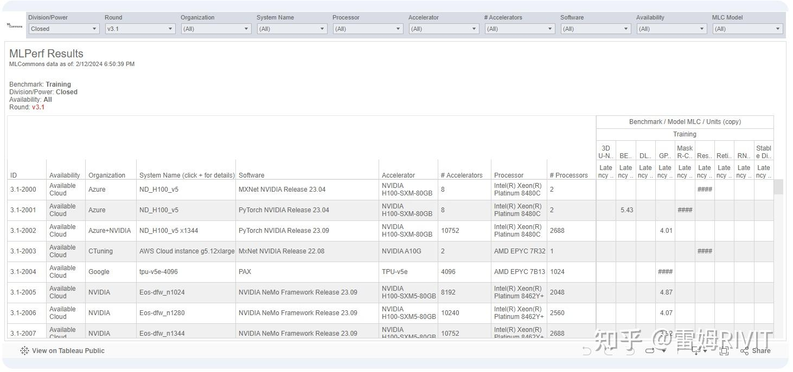
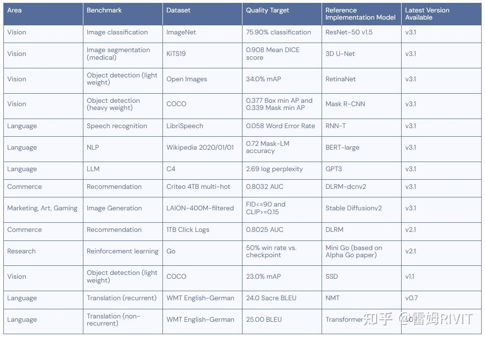

# 1 总体介绍 

**MLPerf**
- 人工智能计算的跑分软件
    - [MLCommon](https://zhida.zhihu.com/search?content_id=242670823&content_type=Article&match_order=1&q=MLCommon&zhida_source=entity)  
    - 推出的一项基准测试，专门用于测试机器运行人工智能任务时的性能
- 提供7种不同级别的测试：
    - 模型训练
    - 单机
    - 集群多机
    - 模型推理
    - 服务器
    - 个人电脑
    - 手机
    - 开发板
    - 硬盘存储

- 结果




分别对应着组织，GPU，GPU数量，CPU，CPU数量，具体项目和分数。

- 测试
- Linux系统
- 不同的测试项目




# 2 MLPerf Inference and MLPref Trainning
MLPerf Inference Benchmark
https://arxiv.org/abs/1911.02549

MLPERF TRAINING BENCHMARK
https://arxiv.org/pdf/1910.01500

https://arxiv.org/abs/1910.01500

MLPerf Inference 与 MLPerf Training 是两个不同方向的基准测试

**MLPerf Inference Benchmark**（你提到的链接 https://arxiv.org/abs/1911.02549）针对
**推理（inference）** 场景，评估的是已经训练好的模型在不同硬件和软件环境下执行任务（如图像分类、目标检测、语言生成等）的性能表现，它侧重于**推理速度、延迟、吞吐量**等指标。

MLPerf Training Benchmark
专注于**训练阶段**，评测模型从零开始训练到满足质量目标的时间（time-to-train），衡量系统在训练效率、可复现性及扩展性方面的能力

|基准类型|测试阶段|主要衡量目标|应用场景|
|---|---|---|---|
|**Inference**|模型推理阶段|推理速度、延迟、吞吐量、精度|模型上线后的实际运行表现|
|**Training**|模型训练阶段|从训练到达到一定质量所需时间、效率|模型开发、训练体系的优化与对比|


- **Inference**：你训练好了模型，现在想知道“推理时有多快，延迟是多少，一秒能处理多少请求”。    
- **Training**：你关注“训练一个模型要多久才能收敛”以及“不同系统、硬件在训练上的效率如何”。

与 **Training 基准**的区别
- **MLPerf Training**：衡量训练速度（多久能把模型训到合格精度）。
- **MLPerf Inference**：衡量推理速度和效率（模型在实际应用中能多快、多稳地产生输出）。

# 3 MLPerf Inference  是什么

MLPerf Inference 是 **MLCommons 基金会**制定的一个 **人工智能推理性能评测基准**。它的目的，是为 AI 芯片厂商、系统厂商和研究机构提供一套 **统一、可比、可复现** 的测试规则和工具，用来衡量在不同硬件和软件环境下，AI 模型在推理（inference）阶段的性能表现。

简单来说，它就是 AI 行业的一个 **“跑分标准”** —— 类似 CPU/GPU 有 SPEC、LINPACK、Geekbench，AI 推理就有 MLPerf Inference。


主要特点
1. **覆盖任务广**：包括图像分类（ResNet50）、目标检测（SSD、RetinaNet）、语音识别（RNNT）、自然语言处理（BERT、GPT/LLaMA2 等）、推荐系统、医疗 AI 等。
    
2. **统一指标**：
    - **吞吐量 (Throughput/QPS)**：每秒能处理多少请求或样本。
    - **延迟 (Latency)**：响应时间，特别是大模型里强调 **TTFT（Time To First Token）** 和 TPOT（Time Per Output Token）
    - **准确率 (Accuracy)**：结果要达到与参考实现一致的精度要求（例如 BERT 的 F1，图像分类的 top-1 准确率）。
3. **场景化测试**：定义了几种推理应用场景：
    - **Offline**（离线批量处理）**Offline**：一旦被测系统（SUT）完成上一个查询，Loadgen 就会发送下一个查询。
    - **Server**（在线服务并发请求） **Server**：LoadGen 在启动时会在单个查询中将所有样本发送到被测系统（SUT）。 可以理解为Server是模拟服务器在响应查询请求，而Offline则是离线生成最大的压力，应该能把GPU跑得更满一点吧。
    - **SingleStream**（单请求延迟）
    - **MultiStream**（多请求实时流）
    - **Interactive**（交互式，如大语言模型对话）
可以理解为Server是模拟服务器在响应查询请求，而Offline则是离线生成最大的压力，应该能把GPU跑得更满一点吧。
1. **标准化流程**：通过官方提供的 **LoadGen（负载生成器）** 驱动测试，保证所有提交遵循相同规则，可比较。
2. **厂商参与广泛**：NVIDIA、Intel、AMD、华为、寒武纪、谷歌、Meta 等厂商都会定期提交成绩，成绩对外公开，常被视为衡量 AI 硬件实力的重要参考。

---


# 4 MLPref 论文

### 4.1.1 摘要

- 机器学习(ML)需要行业标准的性能基准来支持许多新兴的ML软件和硬件解决方案的设计和竞争性评估。
- 但是ML训练提出了其他领域所没有的三个独特的基准挑战:
- 提高训练吞吐量的优化可能会增加获得解决方案的时间，训练是随机的，获得解决方案的时间表现出很大的差异，软件和硬件系统如此多样化，以至于使用相同的二进制、代码甚至超参数进行公平的基准测试是困难的。
- 因此，我们提出了MLPerf，这是一个克服这些挑战的ML基准。我们的分析定量地评估了MLPerf在推动来自多个供应商的两轮结果的性能和可伸缩性改进方面的有效性

  

- 机器学习硬件和软件系统的需求正在迅速增长。
- 在机器学习应用程序的驱动下，不同机器学习推理系统的数量呈爆炸式增长。超过100家组织正在构建机器学习推理芯片，结合现有模型的系统在功耗上至少提高了3个数量级，在性能上提高了5个数量级。它们的范围从嵌入式设备到数据中心解决方案。为硬件提供动力的是十几个或更多的软件框架和库。
- ML硬件和ML软件的无数组合使得以架构中立、代表性和可复制的方式评估ML系统性能具有挑战性。
- 很明显，需要一个行业范围内的标准ML基准测试和评估标准。MLPerf Inference会响应这个调用。
- 在本文中，我们提出了评估机器学习推理系统的基准测试方法。在30多个组织以及200多名机器学习工程师和实践者的推动下，MLPerf规定了一套规则和最佳实践，以确保具有不同架构的系统之间的可比性。第一次提交征集收集了来自14个组织的600多个可重复的推断性能测量，代表了30多个展示了广泛功能的系统。提交的文件证明了基准的灵活性和适应性。


### 4.1.2 结论

- MLPerf inference的核心贡献是一个全面的框架，用于在一系列用例中测量ML推理性能。我们在这里简要地总结了推理基准测试的三个主要方面。

- 性能指标。为了公平地比较人工智能系统，在性能指标上达成共识至关重要。我们设计了一组这样的指标:延迟、有延迟限制的吞吐量、吞吐量和每个查询的最大推断数——所有这些都取决于预定义的准确性目标和实现该目标的可能性。延迟或推理执行时间通常是系统和架构设计师使用的度量标准。相反，我们将延迟限制吞吐量确定为工业用例中推理性能的度量，代表数据中心推理处理。虽然这个指标对于数据中心cpu来说很常见，但我们将它引入到数据中心ML加速器中。先前的工作通常使用吞吐量或延迟;本文中的公式反映了更现实的部署约束。
- 精度/性能为代价。机器学习系统经常在准确性和性能之间进行权衡。现有技术在可接受的推理精度退化方面差异很大。我们咨询了来自工业界和学术界的领域专家，为MLPerf Inference设置了精度和可容忍的退化阈值，允许对结果进行分布式测量和优化，以调整精度/性能权衡。这种方法使人工智能系统的设计和评估标准化，并使学术和工业研究成为可能，这些研究现在可以使用MLPerf Inference工作负载的精度要求，将它们的努力与工业实施和既定的精度标准进行比较。
- 人工智能推理加速器的评估。这项工作的一个重要贡献是识别和描述人工智能推理加速器有用的度量和推理场景(服务器、单流、多流和离线)。加速器可能在一个领域脱颖而出，而在另一个领域表现不佳。这种退化要归功于诸如批处理(或缺乏批处理)之类的优化，这是依赖于用例的。MLPerf在五个网络上为四种推理场景(服务器、多流和离线)中的三种引入了批处理，这些场景可以为人工智能系统的开发和研究提供额外的优化。

- 机器学习仍在不断发展。为了跟上变化，我们建立了维护MLPerf的流程[36]。我们正在为下一轮提交更新机器学习任务和模型，同时坚持我们在本文中描述的已建立的基本机器学习基准测试方法。然而，我们还有很多东西要学。MLPerf组织欢迎投入和贡献;请访问[https://mlperf.org/get-involved](https://link.zhihu.com/?target=https%3A//mlperf.org/get-involved)。


### 4.1.3 引言

机器学习(ML)为计算机视觉([20]、[18]、[34]、[29])、自然语言处理([50]、[16])、自动驾驶汽车([55]、[6])和自主机器人([32])等各种应用提供支持。尽管ml模型训练一直是开发的瓶颈和相当大的费用[4]，但推理已经成为一项关键的工作。模型每天可以处理多达200万亿个查询，并执行超过60亿次翻译[31]。为了满足这些不断增长的计算需求，硬件、软件和系统开发人员通过设计优化的机器学习硬件和软件，专注于各种用例的推理性能。据估计，超过100家公司正在瞄准专门的推理芯片[27]。相比之下，针对培训芯片的企业只有20家左右[48]。

每个机器学习系统都采用独特的推理方法，权衡延迟、吞吐量、功率和模型质量。结果是ML任务、模型、数据集、框架、工具集、库、体系结构和推理引擎的许多可能组合，使得评估推理性能的任务几乎难以处理。任务范围很广，包括但不限于图像分类和定位、对象检测和分割、机器翻译、自动语音识别、文本到语音以及推荐。即使对于特定的任务，例如图像分类，许多ML模型也是可行的。这些模型适用于各种场景，从在智能手机上拍摄一张照片，到在自动驾驶汽车上通过多个摄像头连续并发地检测行人。因此，ML任务具有截然不同的质量要求和实时处理需求。甚至模型的功能和操作的实现也可以是高度特定于框架的，并且它们增加了设计任务的复杂性。为了量化这些权衡，ML领域需要一个架构中立、具有代表性和可再现性的基准。

学术和工业组织都开发了机器学习推理基准。现有技术的例子包括工业界的AIMatrix[3]、EEMBC MLMark[17]和AIXPRT[43]，以及学术界的AI Benchmark[23]、TBD[57]、Fathom[2]和DAWNBench[14]。它们都对ML基准测试做出了重大贡献，但它们的开发没有得到ML系统设计人员的全行业投入。因此，在代表性的机器学习模型、指标、任务和规则上没有达成共识。

在本文中，我们提出了MLPerf Inference，这是一个标准的机器学习推理基准套件，具有适当的指标和基准测试方法(补充MLPerf Training[35])，可以公平地衡量机器学习硬件、软件和服务的推理性能。工业界和学术界利用来自30多个组织的研究人员和开发人员的意见，共同开发了基准套件及其方法。

超过200名ML工程师和从业者为这项工作做出了贡献。MLPerf Inference是由架构、系统和机器学习方面的专家就最佳基准测试技术达成的共识。我们解释了为什么设计正确的机器学习基准测试指标、创建现实的机器学习推理场景和标准化评估方法可以实现现实的性能优化，以提高推理质量。

1. 为了再现性和可访问性，我们选择了具有代表性的工作负载。机器学习生态系统充斥着各种模型。比较和对比这些模型之间的ml系统性能是非常重要的，因为它们在模型复杂性和执行特征上有很大的不同。此外，像ResNet-50这样的名称不能唯一地或可移植地描述一个模型。因此，用不稳定的基线量化系统性能改进是困难的。MLPerf的一个主要贡献是选择了允许可重复测量的代表性模型。基于行业共识，MLPerf Inference包含了成熟的模型，并获得了社区的支持。由于业界已经对它们进行了研究，可以构建高效的系统，因此可以进行基准测试，并提供MLsystem技术的快照。MLPerf模型也是开源的，这使它们成为潜在的研究工具。
2. 我们确定了实际评估的场景。机器学习推理系统的范围从深度嵌入式设备到智能手机再到数据中心。它们具有各种实际应用程序和许多优点，每个都需要多个性能指标。正确的指标，反映生产用例，不仅允许MLPerf，而且还允许出版物显示实际的ML系统将如何执行。MLPerf Inference包括单流、多流、服务器和离线四种评估场景。我们通过调查MLPerf的广泛会员(包括客户和供应商)得出了这些结论。这些场景代表了许多关键的推理应用程序。我们表明，在这些场景及其相应的度量下，性能可能会发生巨大变化。MLPerf推理提供了一种模拟被测推理系统真实行为的方法;这样的功能在人工智能基准中是独一无二的。
3. 我们根据实际用例规定目标质量和尾部延迟界限。对于所有形式的机器学习，质量和性能都是密切相关的。系统架构有时会牺牲模型质量来减少延迟、降低总拥有成本(TCO)或增加吞吐量。准确性、延迟和TCO之间的权衡是特定于应用程序的。在识别猫的照片时，用1%的模型精度换取50%的低TCO是谨慎的，但在为自动驾驶汽车检测行人时，这是有风险的。为了反映实际部署的这一方面，MLPerf定义了模型质量目标。我们为推理延迟和模型质量建立了每个模型和场景目标。延迟边界和目标质量基于从ML系统最终用户和ML从业者收集的输入。随着MLPerf根据行业需求改进这些参数，更广泛的研究团体可以跟踪它们以保持相关性。
4. 我们设置了允许用户显示硬件和软件功能的许可规则。社区已经接受了各种语言和库，因此MLPerf Inference是一个语义级基准。我们指定任务和规则，但将实现留给提交者。我们的基准测试允许提交者优化参考模型，通过他们喜欢的软件工具链运行它们，并在他们选择的硬件上执行它们。因此，MLPerf Inference有两个部分:封闭和开放。严格的规则管理封闭的部门，这解决了缺乏标准的推理基准测试工作流程的问题。另一方面，开放划分允许提交者更改模型并演示不同的性能和质量目标。
5. 我们提出了一种推理基准测试方法，该方法允许模型在保持上述贡献的同时频繁更改。ML发展迅速，因此任何基准测试的挑战都不是执行任务，而是实现一种能够承受快速变化的方法。MLPerf Inference主要关注基准的模块化设计，以降低添加新模型和任务的成本，同时保留使用场景、目标质量和基础设施。正如我们在第VI-E节中所展示的，我们的设计允许用户轻松地添加新模型。我们计划扩大范围，包括更多的领域和任务。我们正在努力添加新的模型(例如，推荐和时间序列)，新的场景(例如，“突发”模式)，更好的工具(例如，移动应用程序)和更好的指标(例如，定时预处理)，以更好地反映整个机器学习管道的性能。

影响。MLPerf Inference(0.5版本)于2019年10月进行了测试。我们收到了来自14个组织的600多份提交，涵盖了各种任务、框架和平台。审计测试自动评估了提交的文件，并将其中的595份文件清除为有效。结果显示了从嵌入式设备和智能手机到数据中心系统的四个数量级的性能变化，展示了不同的指标和推理场景如何在更稳健地访问AI推理加速器方面有用。

跟上时代。由于ML仍在不断发展，我们建立了一个定期维护和更新MLPerf Inference的流程。请参阅[http://mlperf.org](https://link.zhihu.com/?target=http%3A//mlperf.org)了解最新的基准、规则等。

# 5 基础知识点 

## 5.1 sample and query的意思
https://blog.csdn.net/weixin_58277783/article/details/142006196

MLPerf Inference 有2个基本概念: `sample`和`query`。
- sample（样本）是运行inference的单位，例如一个image或sentence。
- query（查询）是一组进行Inference的N个sample。例如单个query包含8个image。


# 6 open_orca 数据集 

Open-Orca 数据集是一个旨在增强开源==大型语言模型推理能力的文本数据集==。该数据集由 Open-Orca 团队开发，基于 FLAN Collection 数据集，通过向 GPT-4 和 GPT-3.5 提交问题并获取其回答来进行增强。这些增强回答被用作训练和评估自然语言处理模型的数据。


Validation 数据集
- **用途**：模型推理时的 **性能评估（throughput/latency）和准确率验证**。
- **特点**：
    - 数据规模通常较大，覆盖任务的代表性样本。
    - 在 MLPerf 中用于生成官方指标，比如 QPS（queries per second）、延迟分布，以及 accuracy。
    - 不能随意修改或子采样，保证结果可复现、可比。


Calibration 数据集
- **用途**：**INT8/FP16 量化时的校准数据**。  校准量化
- **特点**：
    - 规模远小于 validation 数据集（只需几百到几千样本）。
    - 主要用于计算激活分布（activation distribution），从而确定量化 scale/zero-point 或校准表。
    - **不会**用来算最终性能或准确率指标，只是辅助量化。

总结 
- **Validation** → 大规模，用来跑 benchmark 得出性能+准确率结果。
- **Calibration** → 小规模，只在量化推理场景下用来校准权重/激活范围，不参与最终评测。


# 7 推理基准测试的性能指标


- 性能指标：
	- 延迟、有延迟限制的吞吐量、吞吐量和每个查询的最大推断数。延迟或推理执行时间通常是系统和架构设计师使用的度量标准。
	- 精度: 
- AI推理加速器的评估


1. **性能**：
    - **TTFT**（Time‑to‑First‑Token）与 **TPOT**（Time‑per‑Output‑Token），Server/Interactive 关键；
    - 吞吐（QPS / tokens/s），Offline 关键；
    - 资源利用：显存占用、带宽、算子覆盖率、引擎构建时间。[GitHub](https://github.com/mlcommons/inference/blob/master/language/llama2-70b/README.md?utm_source=chatgpt.com)
2. **准确率/一致性**：复用 `evaluate-accuracy.py` 体系，按任务提供对齐的评测集与判分；通过 **TEST06** 做输出一致性校验。[GitHub+1](https://github.com/mlcommons/inference/blob/master/language/llama2-70b/evaluate-accuracy.py?utm_source=chatgpt.com)
    
3. **稳定性**：长稳跑、错误率、OOM 率、冷启动时延。
    
4. **易用性**：部署步骤、文档完善度、容器与权重管理、对 MLPerf/LoadGen 的即插即用程度。
    
5. **能效**（可选）：tokens/J 或 QPS/W。

## 7.1 吞吐 
QPS / tokens/s
描述：吞吐量测量指的是在单位时间内GPU处理的数据量，通常以每秒处理的样本数（samples per second）或每秒处理的图像数（images per second）表示。这种方法更适合评估GPU在处理大批量数据时的效率。

优点：
直接反映GPU处理数据的能力。
易于比较不同GPU或不同配置的性能。

局限：
需要对数据进行合理分批，以避免批量大小对结果的影响。
与运行时间测量类似，可能受到系统其他因素的干扰。

与涉及单个样本数据处理的延迟（Latency）不同，为了实现最大吞吐率（Throughput），我们希望在集群训练的过程中有效并行处理尽可能多的样本数据。这种有效的并行性依赖于数据、模型和设备规模。因此，为了正确测量最大吞吐率，可以执行以下两个步骤：

1. 估计允许最大并行度的最佳训练样本数据批量大小，即Batch Size；
2. 在AI训练集群中，给定这个最佳Batch Size，测量神经网络模型在一个step每1秒钟内可以处理的训练样本数据。

要找到最佳Batch Size值，一个好的经验法则是达到AI加速卡（GPU/NPU...）对给定数据类型的内存限制，即Batch Size接近占满内存。这取决于硬件类型、神经网络的参数大小以及输入数据的大小等。


## 7.2 准确率


### 7.2.1 Rough指标 

ROUGE（Recall-Oriented Understudy for Gisting Evaluation）是一类常用于**自动文本摘要**、**机器翻译**、**文本生成**质量评估的指标。它的核心思想：

> 用 n-gram（词或字的连续片段）来衡量生成文本和参考文本之间的**重叠程度**。


ROUGE-1
- **比较单位**：1-gram（单个词）
- **含义**：看生成的文本中有多少单词和参考答案匹配。
- **代表模型是否抓住了主要的关键词。**
- 举例：
    - 参考：`the cat sat on the mat`
    - 生成：`the cat is on the mat`
    - 重叠词：`the, cat, on, the, mat` → 匹配比例就是 ROUGE-1。


----

ROUGE-2
- **比较单位**：2-gram（连续两个词）
- **含义**：衡量模型生成的词序与参考文本更长的片段的匹配程度。
- **比 ROUGE-1 更严格，考虑局部的词序关系。**

- **比较单位**：2-gram = 连续两个词的组合
    
- **衡量的东西**：
    - 不只是看词对不对，还看词和它后面邻居是不是也正确。
    - 比如模型生成“machine learning”而不是“learning machine”时，顺序对了，ROUGE-2 才加分。
- **意义**：
    - 它更严格地要求模型不仅有正确的关键词，还得把这些关键词正确地组合成合适的短语。
    - 体现模型在局部上下文中（即短语、片段级别）的质量。

🔹 **例子**  
参考答案：`the cat sat on the mat`  
模型输出：`the cat is on the mat`

- 单词匹配（ROUGE-1）：`the`, `cat`, `on`, `the`, `mat`（很多词一样）
- 双词匹配（ROUGE-2）：`the cat`, `on the`, `the mat`（比 ROUGE-1 少）  
    ➡️ ROUGE-2 低于 ROUGE-1，因为有些短语结构不同。


----

ROUGE-L
- **比较方式**：最长公共子序列（Longest Common Subsequence, LCS）
- **含义**：看生成文本和参考文本之间，最长的按顺序匹配的子序列有多长。
- **代表模型在句子整体结构、顺序方面和参考文本的接近程度。**

- **衡量的东西**：
    - 在保持词的**原始顺序**不变的前提下，模型生成的序列里能和参考文本对上的最长连续或不连续的序列。
    - ==不要求完全连续，但要求顺序正确==。
- **意义**：
    - 体现模型生成文本在句子整体结构和顺序层面的合理性。
    - 比 ROUGE-1、ROUGE-2 更接近句子级、语义流畅度方面的评价。

参考答案：`the cat sat on the mat`  
模型输出：`on the mat the cat sat`

---


### 7.2.2 实际计算过程中的一些细节
1. **多参考文本**：有时一个任务会有多个参考答案，需要对比后取最大值或平均值。
2. **句子级 / 文档级统计**：通常 ROUGE 会在句子或文档级别累加 n-gram 统计后再统一算比例。
3. **归一化**：有的报告会把原本 0.0～1.0 的得分乘以 100 → 变成百分比形式，比如 ROUGE-1 = 0.444 → 报告成 44.4。


---

### 7.2.3 具体计算

拿模型生成的文本（Candidate）和参考文本（Reference），统计两边 n-gram 或 LCS 的**重叠数量**，然后用**召回率 / 精确率 / F1** 来表示。

![[Pasted image 20250831185835.png]]


参考文本 (Reference)： （标准答案）
`the cat sat on the mat`

模型输出 (Candidate)：（模型自己做出来的结果 ）
the cat is on the mat


- **1-gram**
    - Reference: the, cat, sat, on, the, mat
    - Candidate: the, cat, is, on, the, mat
    - 重叠：the, cat, on, the, mat → 5 个
    - ROUGE-1 (Recall) = 5 / 6 = 0.8333
        
- **2-gram**
    - Reference: the cat, cat sat, sat on, on the, the mat
    - Candidate: the cat, cat is, is on, on the, the mat
    - 重叠：the cat, on the, the mat → 3 个
    - ROUGE-2 (Recall) = 3 / 5 = 0.6

ROUGE-L 是基于 LCS (Longest Common Subsequence) —— 最长公共子序列。

用同样的例子：

Reference: `the cat sat on the mat`  
Candidate: `the cat is on the mat`

找 LCS：
- 最长公共子序列 = `the cat on the mat`
- 长度 = 5
- Recall = LCS 长度 / 参考文本长度 = 5 / 6 ≈ 0.8333
- Precision = LCS 长度 / 模型输出长度 = 5 / 6 ≈ 0.8333
- F1 = 2 × (P × R) / (P + R) ≈ 0.8333

## 7.3 延迟限制和吞吐量之间的关系 


B.指标:延迟与吞吐量延迟和吞吐量是密切相关的，将它们放在一起考虑是至关重要的:我们使用延迟限制吞吐量(表III)。当延迟限制出现时，系统可以提供出色的吞吐量，但性能却很差。例如，脱机和服务器场景之间的区别在于，后者施加了延迟限制，并实现了不一致的到达率。结果是较低的吞吐量，因为大的输入批次变得更难以形成。对于某些系统，服务器场景的延迟限制会使性能降低3%(相对于脱机);对其他人来说，损失要大得多(50%)。


# 8 场景

- 在照片分类等离线批处理中，所有数据都可以在（网络）存储中轻松获得，从而使加速器能够达到并保持峰值性能。 
- 相比之下，翻译、图像标记和其他 Web 应用程序可能会根据最终用户流量而经历不同的到达模式。
- 增强现实和自动驾驶汽车等实时应用程序处理持续的数据流，而不是将其全部存储在内存中。 

仅对设备上的推理延迟进行计时并不能反映现实世界的要求

MLPerf推理提供了一种方法来模拟被测推理系统的真实行为：开发了负载生成器（LoadGen）工具，它是一个模拟现实系统行为的查询流量生成器，有以下四个测量场景，每个场景解决一类用例，模拟移动设备、自动驾驶车辆、机器人和基于云的设置的机器学习工作负载行为。
Load Generator是MLPerf的负载生成器，用于生成query，跟踪 query 的 Latency 并验证结果的准确性。每次运行 LoadGen 都会使用四种模式之一来评估系统的性能，最后提交的结果可以是{models, scenarios}的任意组合。

---

1 Offline （离线批处理）
模拟场景： 批处理应用程序，其中所有输入数据立即可用且延迟不受限制。例如 识别相册中的人物和位置。
测试方法：一次请求包含一大批 测试样本。 一次性全部给出到推理系统。 被测系统可一次或多次以任意顺序返回结果。
测试指标： 关注整体吞吐率 QPS

2 Server（在线服务并发请求）
模拟场景： 在线请求数据中心服务，比如百度的在线翻译。 查询随机到达。
特点：每个请求只有一个样本，请求到达SUT的时间服从泊松分布。
指标：在SUT预定好的延迟边界（latency bound）内的 SUT的QPS（每秒查询数）。 表示在满足 QoS 要求的情况下每秒可实现的查询数

3 SingleStream（单请求延迟流）
模拟场景： 像手机实时应用一样，一个个请求顺序到来。 一系列输入被依次处理，模拟例如用户使用智能手机拍照的真实场景。反映客户端应用对响应性的需求。
测试方法：LoadGen 一次只发一个请求，下一个请求需等待上一个完成。一个 query = 一个 sample (batch size = 1)，连续发
测试只掉: 单样本的延迟时间 .   。为了测量性能，我们将一个查询注入推理系统;当查询完成时，我们记录完成时间并注入下一个查询。度量是查询流的第90百分位延迟。

4 MultiStream（多请求实时流）
常用于工业自动化，遥感，自动驾驶摄像头场景。多路视频同时输入。 固定大小的一批输入被一个接一个地处理，例如检测障碍物的多摄像头汽车系统。
测试方法 固定时间间隔发送包含 N 个样本的 query， 检查系统能否在时限内完成
测试指标 多流并发时的延迟表现.  性能指标是系统在满足QoS要求的情况下支持的流的整数个数。

5 Interactive（交互式，大语言模型对话）
典型 LLM 应用，用户与模型交互。特点：强调 低 TTFT 和 稳定的 TPOT，以保证流畅对话体验。


![[209ec2e9f5b2406aa1483180dd96391b.png]]

---

场景	query生成	持续时间	Samples/query	评价指标
Single stream	SUT 完成前一个查询后，LoadGen 立即发送下一个查询	1024 queries and 60 seconds	1	第90百分位延迟
Multiple stream (1.1 and earlier)	如果 SUT 已完成前一个查询，则 LoadGen 在每个延迟约束下发送一个新查询，否则新查询将被删除并计为一个超时查询	270,336 queries and 60 seconds	Variable, see metric	支持每个查询的最大推理数（流的数量）
Multiple stream (2.0 and later)	一旦 SUT 完成前一个查询，Loadgen 就会发送下一个查询	270,336 queries and 600 seconds	8	99%-ile 测量延迟
Server	LoadGen 根据泊松分布向 SUT 发送新查询	270,336 queries and 60 seconds	1	支持的最大泊松吞吐量参数
Offline	LoadGen 在启动时将所有查询发送到 SUT	1 query and 60 seconds	至少 24,576	以每秒样本数衡量的吞吐量

![[Pasted image 20250902222228.png]]


---
loadGen针对不同的测试场景生成查询流量
下图显示了 LoadGen 如何为每个场景生成查询流量。 例如，在服务器场景中，它根据泊松分布发出查询来模拟服务器的查询到达率。 在单流情况下，它向 SUT 发出查询并等待该查询完成，然后再发出另一个查询。

![[7066bb501345479c8aac971ffb20d72a.png]]


## 8.1 Offline模式


代表批处理应用程序，其中所有输入数据立即可用且延迟不受限制。一个例子是识别相册中的人物和位置。
LoadGen 向系统发送一个包含所有要处理的样本数据 ID 的单个查询，即一次发送所有query给Inference系统，系统可以自由地以任何顺序处理输入数据。

指标是以每秒样本数衡量的吞吐量。

## 8.2 Server模式 

https://mlcommons.org/2024/03/mlperf-llama2-70b/
The server scenario in [MLPerf Inference benchmarks](https://arxiv.org/pdf/1911.02549.pdf) simulates online applications where query arrival is random and the response latency is important. 
The query arrival traffic is described with a Poisson distribution where the ==query arrival rate (queries per second or “target_qps”) is the Poisson parameter==. The test is successful if latency constraints for the benchmark are met.
queries per second （从loadGen发射query 到这个query到达 SUT 的时间） 就是泊松参数

query 到达时间是泊松分布（模拟随机请求）
 
查询到达是随机的且延迟很重要的在线请求数据中心服务，包括百度、谷歌和微软的在线翻译等服务。

负载生成器根据泊松分布发送查询，每个query只包含1个Sample。 SUT 在 15 到 250 毫秒之间的基准特定延迟范围内响应每个查询。 不超过 1% 的查询可能会超过视觉任务的延迟限制，不超过 3% 的查询可能会超过翻译的延迟限制。

性能指标是
QPS 在延迟 bound 下的最大值
最大泊松吞吐量参数（QPS），表示在满足 QoS 要求的情况下每秒可实现的查询数
每秒泊松到达查询数受延迟限制；


### 8.2.1 泊松分布

泊松分布（**Poisson Distribution**）是一种离散型概率分布，用于描述在固定时间间隔或空间区域内某事件发生次数的概率。它特别适合**事件稀疏、独立发生**的场景。


如果事件在单位时间或单位空间内发生的平均次数为 λ\lambdaλ，那么事件在该时间或空间内发生 k 次的概率为泊松分布：
![[Pasted image 20250902160620.png]]
其中：

- λ>0 是平均发生次数（也叫强度参数）
- e≈2.71828 是自然对数的底
- k!是阶乘


- **均值和方差**  
    对于泊松分布，均值和方差都等于 λ：
    E[X]=λ,Var(X)=λE[X] = \lambda, \quad \text{Var}(X) = \lambdaE[X]=λ,Var(X)=λ
- **稀疏事件**  
    事件发生次数较小且独立，泊松分布是合理的建模选择。
    
- **极限定理**  
    当 nnn 很大、事件概率 ppp 很小，且 np=λn p = \lambdanp=λ 固定时，二项分布 Binomial(n,p)\text{Binomial}(n, p)Binomial(n,p) 可以近似为泊松分布。

![[Pasted image 20250902160735.png]]


应用示例
- 某小时内某超市顾客的到达次数
- 一段道路上某天车祸发生次数
- 某网站每分钟访问次数
- 放射性物质在单位时间内的衰变次数

---

![[b5404341-cad8-4d08-9b55-f3b63a219221.png]]

这里是泊松分布的概率质量函数（PMF）图示，不同的 λ 值对应不同的分布形状：
- λ = 1：事件很少发生，大部分概率集中在 0 或 1 次
- λ = 4：事件发生次数更均匀，分布向右拉伸
- λ = 10：事件发生次数较多，分布更加平滑，接近正态分布

可以直观看到，随着 λ 增大，泊松分布的均值和方差都增大，分布中心向右移动


## 8.3 Single stream 单流

此场景表示查询样本大小为 1 的一个推理查询流，反映了响应能力至关重要的许多客户端应用程序。如智能手机上的离线语音转录。

为了测量性能，Load Gen 注入单个query，每次查询只包含1个sample；在处理完上一个query后再发送下一个query，直到超过设定的query数 并且 达到设定的测试时间。query数量和测试时间的双重要求旨在能够同时适配大型和小型推理系统。

重点指标
- 延迟 lantency
- 性能指标是查询流的第90百分位延迟，指在一组查询流中，按照延迟的升序排列后，处于第90%的延迟值。
- 注意，最后衡量的结果是Tail Latency而不是average Latency。


## 8.4 Multiple stream 多流

代表具有查询流的应用程序，但每个查询都包含多个推理。例如，许多自动驾驶车辆分析来自六到八个同时传输的摄像机的帧。 因此，一个“查询（query）”包含 **N 个样本（samples）**，而不是 1 个。

为了对并发场景进行建模，LoadGen 以固定时间间隔（例如 50 ms）发送包含 N 个输入样本的新查询。 该间隔是特定于基准的，并且还充当范围从 50 到 100 毫秒的延迟界限。 

如果系统(SUT)可用，它将处理传入的查询。 如果它仍在处理某个时间间隔内的前一个查询，则它会跳过该时间间隔并将剩余的查询延迟一个时间间隔。不超过 1% 的查询可能会产生一个或多个跳过的间隔。 ( 如果 **还没处理完前一个查询**，LoadGen 不会无限堆积，而是**跳过这一个时间片**， 就在这个时间片中不输入新的了， 相当于**延迟到下一个间隔**。 在下一个时间片中再输入 新的input)

查询的 N 个输入样本在内存中是连续的，这准确地反映了生产输入管道，并避免了惩罚系统，否则系统会要求在开始推理之前将样本复制到连续的内存区域。


性能指标：受延迟限制的流数量  number of streams subject to latency bound 
- **MLPerf v1.1 及更早版本**
    - 指标是：在满足延迟要求的前提下，**最多能支持多少并行流（streams）**。
    - 即每个 query 中的样本数 = stream 数量。
- **MLPerf v2.0 及更高版本**：
    - 改为统计 **99% 分位延迟（99%-ile latency）**。
    - 这样可以统一不同场景的评价方式（和 SingleStream、Server 场景一致，都是看尾延迟）。


## 8.5 确保符合基准标准

为了确保合规性并防止潜在的漏洞，MLCOOM 设计了一种合规性检查机制。该测试旨在验证提交者生成的令牌是否符合预定义的标准。具体来说，对提交的内容进行了三项关键测试：

1. **第一个令牌一致性**：出于计时目的，生成的第一个令牌必须与报告给 LoadGen 的第一个令牌相匹配，确保令牌生成过程的同步和准确性。
2. **EOS 令牌验证**：序列结束（EOS）令牌不应在生成的输出中生成超过一次，以保持序列完成的一致性和完整性。
3. **令牌计数验证**：模型生成的令牌总数必须与报告给 LoadGen 的数量一致，以验证生成的输出的完整性和准确性


# 9 推理提交系统

MLPerf Inference提交系统包含一个被测系统(SUT)、负载生成器(LoadGen)、一个数据集和一个准确性脚本。


## 9.1 SUT

精度量化校准
我们还允许对许多不同的数字格式进行量化，以确保体系结构的中立性。提交者提前注册他们的数字，以帮助指导准确的目标讨论。批准的列表包括INT4、INT8、INT16、UINT8、UINT16、FP11(1位符号、5位尾数和5位指数)、FP16、bfloat16和FP32。量化到低精度格式通常需要校准以确保足够的推理质量。对于每个参考模型，MLPerf提供了一个小的固定数据集，可用于校准量化网络。此外，它提供了预量化到INT8的MobileNet版本，因为没有再训练(我们不允许)，精度会急剧下降。

## 9.2 LoadGen 
- **含义**：MLPerf 专门开发的 **负载生成器 (Load Generator)**。
- **作用**：
    - 模拟不同 **场景** 下的真实推理请求模式。
    - 比如：
        - **单流 (SingleStream)**：像手机实时应用一样，一个个请求顺序到来。
        - **多流 (MultiStream)**：类似自动驾驶摄像头，多路视频同时输入。
        - **批处理 (Server/Offline)**：一次处理一大批请求，适合数据中心。
- **意义**：让不同提交者在 **统一负载模式下测试**，保证结果可比。
- **类比**：就像跑分软件的“压力测试模块”，确保所有人跑的任务是一致的。


MLPerf推理提供了一种方法来模拟被测推理系统的真实行为：开发了负载生成器（LoadGen）工具，它是一个模拟现实系统行为的查询流量生成器，有以下四个测量场景，每个场景解决一类用例，模拟移动设备、自动驾驶车辆、机器人和基于云的设置的机器学习工作负载行为。

Load Generator是MLPerf的负载生成器，用于生成query，跟踪 query 的 Latency 并验证结果的准确性。每次运行 LoadGen 都会使用四种模式之一来评估系统的性能，最后提交的结果可以是{models, scenarios}的任意组合。


---

![[v2-4a3dc645edb18e54121100159f030492_1440w.jpg]]

LoadGen是MLPerf Inference的流量生成器，它加载SUT并测量性能。它的行为由它在运行开始时读取的配置文件控制。LoadGen根据前面描述的场景(即单流、多流、服务器和脱机)的规则产生查询流量。此外，它还收集用于记录、调试和后处理数据的信息。它记录来自SUT的查询和响应，并在运行结束时报告统计信息、总结结果并确定运行是否有效。图4显示了LoadGen如何为每个场景创建查询流量。例如，在服务器场景中，它根据泊松分布发出查询，以模拟服务器的查询到达率。在单流的情况下，它向SUT发出查询，并在发出另一个查询之前等待该查询完成。

在启动时，==LoadGen请求SUT将数据集样本加载到内存中。SUT可以将它们作为非定时操作加载到DRAM中==，并按照规则规定执行其他定时操作。这些非定时操作包括但不限于编译、缓存预热和预处理。当SUT准备好接收第一个查询时，向LoadGen发送信号;查询是对一个或多个样本进行推理的请求。LoadGen根据所选场景向SUT发送查询。根据该场景，它可以一次提交一个查询、定期提交查询或按泊松分布提交查询。SUT对每个查询运行推理，并将响应发送回LoadGen，后者记录响应或丢弃响应。运行之后，准确度脚本检查记录的响应，以确定模型准确度是否在公差范围内。

我们设计了LoadGen来灵活地处理基准套件的变化。MLPerf Inference在SUT和LoadGen之间有一个接口，因此它可以处理LoadGen中的新场景和实验，并将它们推广到所有模型和SUT，而无需额外的努力。这样做还有助于遵从性和审计，因为许多关于查询到达、定时和准确性的技术规则是在提交程序代码之外实现的。我们通过将LoadGen与基准测试和内部表示(例如，模型、场景、质量和延迟指标)解耦来实现这一壮举。==LoadGen实现是一个独立的c++模块==。

解耦允许LoadGen支持各种语言绑定，允许在任何语言中实现基准测试。LoadGen支持Python、C和c++绑定;可以添加其他绑定。将LoadGen与基准分离的另一个好处是，LoadGen是可扩展的，可以支持更多的场景，例如多租户模式，其中SUT必须在保持QoS约束的同时连续地为多个模型提供服务。


### 9.2.1 qsl_idx 就是 Query Sample Library index 的缩写

**`qsl_idx` 是验证集样本的唯一编号（索引），LoadGen 在 accuracy 日志里用它标记预测属于哪一条数据。**


在 MLPerf Inference 里，qsl_idx 就是 Query Sample Library index 的缩写，全称 Query Sample Library Index。
- MLPerf Inference 的负载生成器（**LoadGen**）会不断发起查询请求，每个请求对应验证集/校准集里的一个样本。
- 这些样本都由 **QSL（Query Sample Library）** 统一管理，可以理解为“测试集中所有样本的一个编号数组”。


----
`qsl_idx` 的含义
- 每个样本 sample (一个句子 或者 好几个句子的组合 )在 QSL 里有一个唯一的 **整数 ID**，就是 `qsl_idx`。    
- 在 accuracy 日志（`mlperf_log_accuracy.json`）里，预测结果会带上这个 `qsl_idx`，用来表明 **“这是第几号样本的输出”**。
- 脚本在解析日志时，就靠 `qsl_idx` 去找到对应的参考答案（ground truth）。

```
{
  "qsl_idx": 1234,
  "data": "7f3a...hex..."
}

```

表示 第 1234 个样本 的输出是 "data" 里那串 token 序列。

---

假设验证集有 24,576 条数据，那么：
- QSL 会包含这 24,576 条的索引：`0, 1, 2, ..., 24575`。
- 日志里每个 `qsl_idx` 就是这些编号之一。
- 我们在代码里：
    `target = targets[qsl_idx]   # 找到对应的参考答案`
    这样就能对齐预测和 ground truth


# 10 文章

- Llama 2 70B: An MLPerf Inference Benchmark for Large Language Models  https://mlcommons.org/2024/03/mlperf-llama2-70b/
- 


# 11 一些MLPref应用的实例

- MLPerf inference基准测试步骤——Google Colab篇_onnx https://blog.csdn.net/weixin_58277783/article/details/135716056
- MLPerf 基础知识笔记   https://blog.csdn.net/weixin_58277783/article/details/142006196


